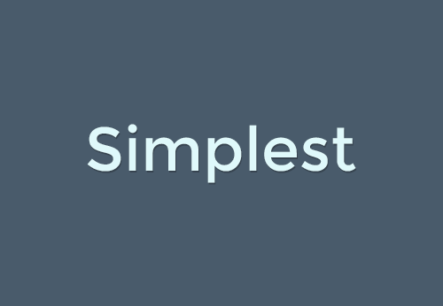

# Moodle "Simplest" theme repository

---------

The Simplest Moodle Theme - Moodle Classic child theme.

Has additional features:

- Redirect to the course if the user has only one course
- Simplified user menu
- Tiled appearance of courses using the topics format
- Simplified login panel
- Hiding the Moodle logo in the footer
- Block of quotes
- 3 additional color styles (easter, mourning, spring)
- Possibility to set style in date range
- **New!** 2 additional color styles (Christmas, Valentines day)
- **New!** compatible with Moodle 4.1, 4.2, 4.3
- **New!** compatible with IOMAD 4.1 and 4.2
- **New!** compatible with https://lmswithai.com/ ver. 0.1

Simplest is built on Boostrap4 and Mustache templates.

Documentation
=============

You can see the theme documentation on: https://lmswithai.com/simplest-theme-download/

Developed
===========================
LMSwithAI

Moodle profile: https://moodle.org/user/profile.php?id=3286395

Website: https://lmswithai.com/

Installation
------------

**First way**

- Clone this repository into the folder theme.
- Access the notification area in Moodle and install.

**Second way**

- Download this repository.
- Extract the content.
- Put the folder into the folder theme of your Moodle.
- Access the notification area in Moodle and install.

**Third way**

- Download this repository.
- Access the install plugins area in Moodle
- Upload repository with file picker
- Click Install plugin from the zip file

